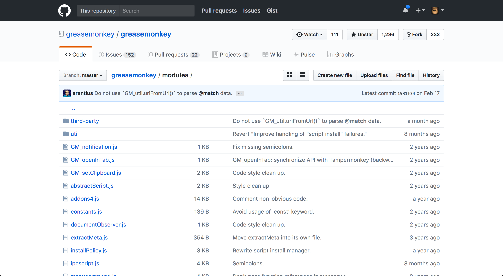

# File sizes right on sight!

GitHub is a large place with good things and not so good things. Personally, I think this user script is a **must** for everybody.

I've always missed being able to have some sense of the file weight but now that I navigate with it, I don't know how I put up with this huge missing feature for so long.

Anyhow, I finally decided to fix it myself. This script should work in any GreaseMonkey/TamperMonkey type of extension.

It's not flawless; sometimes it may skip a file because the DOM is what it is but nothing a quick refresh won't fix. And it doesn't happen often. Still, I'll keep improving it.

**Just try it out, I guarantee you'll enjoy it.**

PS: You have two viewing options for small files. You can either see `> 1KB` or something like `768 B`, meaning bytes. Up to you!